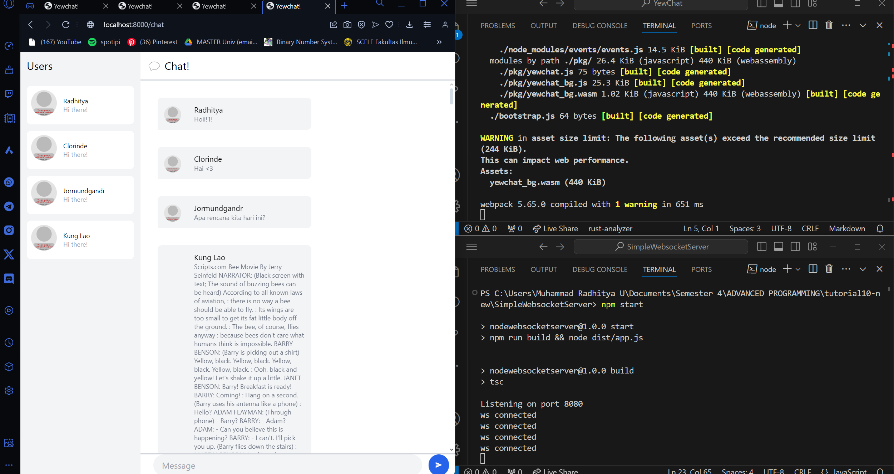
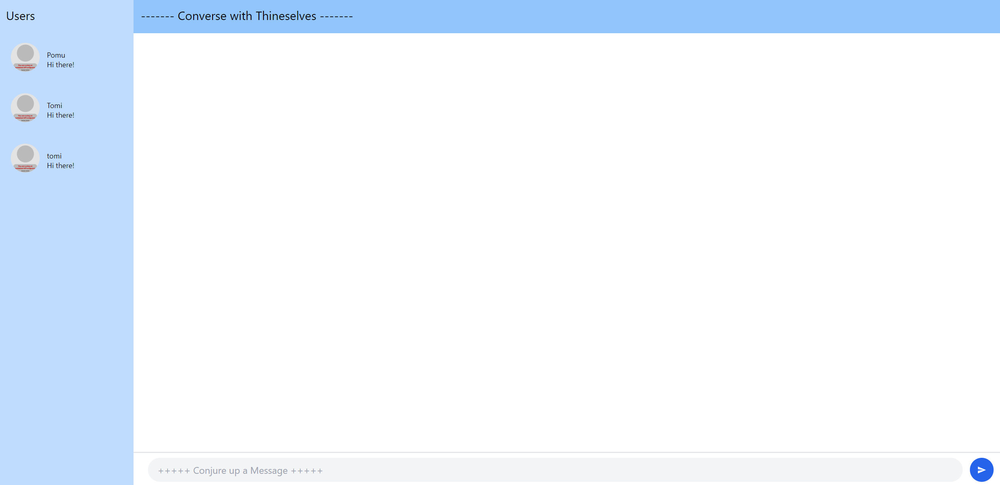

# MODULE 10
## Tutorial 3: WebChat using yew

### 3.1. Original code

### 3.2. Be Creative!

I altered some of the messages to be more medieval feeling! Also altered a bit on the colors. The colors may be limited in normal html as I usually work with a colorwheel but it worked. As for the texts, I was going for a more scroll like theme with the background being sandy yellow but I settled with sky blue instead.